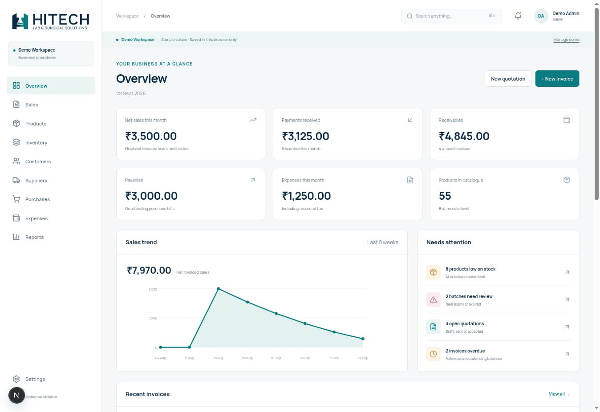

# Billing validation

Review date: 22 September 2026. Scope: the isolated billing demo and regression
checks for the unchanged public website. This record distinguishes automated
checks, observed browser behavior and remaining environment limitations.

## Automated gates

The final gate is a clean `npm ci`, followed by root `npm run check`. That command
runs ESLint with zero warnings, both Next.js/TypeScript checks, the full test suite,
the website production build and the billing production build.

Final results: clean install, lint, both TypeScript checks, all 44 tests and both
production builds **passed**. The website generated 66 pages, including its 55
product pages. Billing generated its App Router entrypoint and robots route.
The first billing build encountered a truncated local Turbopack cache file; removing
only generated `apps/billing/.next` and rebuilding succeeded without source changes.
Standalone production servers also passed HTTP checks for eight website routes/assets
and sixteen billing routes/assets, including local SVGs and PDF fonts. Billing
responses carried `noindex, nofollow`, and its robots route disallowed crawling.

The suite contains **44 tests**: 18 money calculations, 20 billing workflows and
6 existing website/catalogue/enquiry tests. Billing coverage includes:

- Inclusive/exclusive GST, intra/inter-state splits, unresolved jurisdiction,
  discounts, fractional quantities, rounding, overflow and strict decimal parsing.
- Quote conversion, payment balances/voids, partial purchase receipts and returns.
- Expired/quarantined batches, FEFO allocation, insufficient stock and transaction
  rollback; repeated product lines and their original batch allocations on returns.
- Posted snapshots, cancellation, archive behavior, immutable units, credit limits,
  unique supplier references, numbering collisions and financial-year boundaries.
- Report netting, safe CSV output, all 55 catalogue names and blank unknown details.

## Browser workflows observed

Using only the app's forms in the disposable Demo Workspace:

1. Created a customer and a product at ₹100 selling price, ₹60 purchase price,
   8 opening units and a reorder level of 5.
2. Saved/sent a four-unit ₹400 quotation, converted it into an invoice and finalized
   it. Stock became 4 and the item appeared in Low stock.
3. Recorded ₹150, then ₹250. The invoice progressed through partially paid to paid,
   with a final balance of zero.
4. Created a supplier and a ten-unit ₹600 purchase order, received it through a
   purchase bill with a unique supplier reference, finalized and paid it. Product
   history showed opening +8, sale −4, purchase +10 and stock of 14.
5. Created a near-expiry batch and verified near-expiry and expired filters.
6. Attempted to finalize a 999-unit invoice. The app refused negative stock and
   retained the draft. Automated tests separately verify rollback of earlier
   movements in a failing multi-line transaction.

Global search opened with Ctrl+K and returned matching Pipettes products. Report
selection changed the visible report. Mobile navigation opened with accessible
links and branding. Sidebar collapse worked; the Next development indicator
overlapped its bottom control during expansion testing, so the full sidebar was
restored by reload for the saved preview.

## Responsive and visual checks

| Screen | Viewport widths checked |
| --- | --- |
| Dashboard | 320, 375, 430, 768, 1024, 1440, 1920 px |
| Populated invoice editor | 320, 375, 430, 768, 1024, 1440, 1920 px |
| Product table, settings, reports, saved invoice | 320, 768, 1440 px |

No page-level horizontal overflow or broken images was observed. Tables and saved
document previews use intentional internal scrolling on small screens. Mobile
settings tabs also scroll within their own container. The narrow invoice editor
and settings form were visually inspected for readable, stacked controls.

The print stylesheet hides navigation and action controls. It was exercised using
a local, temporary print-style preview harness, not an actual browser print dialog.
That harness is excluded from the repository and was removed before final builds.

## PDF inspection

Generated an ordinary invoice, a quotation and a **10-page invoice** containing
70 line items and 18 terms clauses. Rendered pages were visually inspected. The
documents use A4 pages, repeated table headings, vector branding and embedded local
Manrope fonts. Text extraction verified item/terms content and the ₹ glyph; bounds
checks found no text outside page edges. The invoice correctly showed Paid and a
zero outstanding balance. Long rows/terms continued across pages without clipping.

## Remaining manual checks

- **Automatic browser download was not confirmed in this cloud browser.** PDF
  generation completed and exposed the Save prepared PDF link, but the automation
  did not receive a download event from either action. Generated PDF files were
  independently validated as described above. Verify saving a file in the target
  desktop/mobile browsers before an external demo.
- **The native unsaved-changes prompt was not confirmed.** Triggering it stalled
  this browser's interaction channel. The guard exists for link navigation and
  page unload; accept/cancel behavior still needs a target-browser check.
- Physical printing, production authentication, live payments, tax filing,
  multi-device access and cloud persistence are not part of this demo validation.

## Change boundary

The `apps/website` tree is byte-for-byte unchanged from the approved logo commit
`3798d8c0422983a867647e2e7c854c2f8fc3c788`. Root changes add the billing workspace,
validation/deployment documentation and checks for both apps. Root website
development, build and start commands keep their original behavior.
